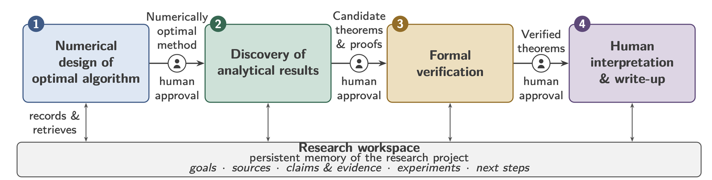

# AutoOPT

AutoOPT is a human-gated, repository-grounded workflow for optimization
research. It coordinates numerical algorithm design through performance
estimation, approved symbolic reasoning, and Lean verification while preserving
researcher control over every consequential transition.

Installing this plugin once makes the complete eight-skill AutoOPT workflow
available together. Installation does not provision external runtimes,
commercial solvers, browser sessions, accounts, authentication, or host
capabilities. Those prerequisites remain separate and are checked by the
relevant skill before use.



## Included skills

- `auto-opt`: orchestrates the human-gated AutoOPT pipeline.
- `research-repo-manager`: grounds work in a versioned research repository and
  maintains evidence.
- `bnb-pep-skill`: formalizes and implements Branch-and-Bound Performance
  Estimation Problems.
- `frontier-llm-consult`: routes approved symbolic-discovery and proof-planning
  consultations.
- `chatgpt-pro-session`: maintains an attended, reusable ChatGPT Pro research
  session.
- `chatgpt-pro-handoff`: packages, previews, submits, monitors, and imports an
  attended consultation.
- `solve-with-highest-reasoning`: runs a configurable-duration native reasoning
  campaign.
- `lean-verify`: builds and checks Lean artifacts for optimization results.

The eight skills are one dependency closure. In particular,
`frontier-llm-consult` preserves both the attended external route and the
explicitly selected native reasoning route.

When AutoOPT is installed as a plugin, do not separately install
`bnb-pep-skill`. The plugin already provides the matching packaged copy, and a
standalone installation can mask it or drift to a different version.

## Human-gated workflow

1. Ground the task and repository state before research work begins.
2. Construct and audit the numerical or performance-estimation problem.
3. Ask for approval before selecting a symbolic-reasoning route, exposing
   repository context, or uploading material externally.
4. Treat generated formulas and proofs as candidates until they are checked.
5. Ask for approval before formal verification and preserve the resulting
   evidence and qualifications.

The orchestrator never interprets plugin installation as permission to upload
data, weaken a research gate, switch reasoning routes silently, or claim that a
solver or Lean check succeeded.

## Runtime prerequisites

- Core skill scripts require Python 3.10 or newer.
- BnB-PEP construction and execution require Julia 1.10 or newer, the project
  environment, JuMP-compatible packages, and an applicable solver. Commercial
  solvers require separate installation and licensing.
- The attended external Stage 2 route requires a separately installed
  Chrome-control capability, the Codex Chrome extension connection, an
  authenticated ChatGPT Web session, and availability of the requested
  ChatGPT model and configuration.
- The native Stage 2 route requires a host with the necessary reasoning,
  persistence, repository, subagent, and local-tool capabilities. The user must
  confirm the campaign duration before initialization.
- Lean verification requires Lean, Lake, the required mathlib project, and any
  separately approved Comparator or Landrun tooling used by the verification
  profile.

When a prerequisite is unavailable, the applicable skill stops and explains
what is missing. It does not silently select a different route.

## Installing from GitHub with Codex

After the `v0.1.0` release is published, register the public AutoOPT marketplace
and install the plugin:

```console
codex plugin marketplace add Shuvomoy/AutoOPT --ref v0.1.0
codex plugin add autoopt@autoopt
```

Start a new Codex task after installation or reinstallation so that the task
loads the current plugin contents. During development, invoke AutoOPT through
the plugin-qualified entry shown by Codex to ensure that a separately installed
standalone skill is not masking the packaged copy.

For local development in the canonical standalone `AutoOPT-plugin`
distribution wrapper, register that wrapper's `autoopt-local` marketplace:

```console
codex plugin marketplace add .
codex plugin add autoopt@autoopt-local
```

Plugin maintainers must update the portable and Codex manifest versions
together. From the canonical distribution-wrapper root, use the atomic updater,
validate the complete package, reinstall it through `autoopt-local`, and then
start a new task:

```console
python3 scripts/update_autoopt_plugin_cachebuster.py
python3 scripts/build_autoopt_plugin.py --write
python3 scripts/build_autoopt_plugin.py --check
python3 scripts/validate_autoopt_plugin.py
codex plugin add autoopt@autoopt-local
```

The Agent Plugins 1.0 specification defines the portable package layout but
does not standardize one universal installation command. Other compatible
clients may use a different local or marketplace installation flow.

## Support tiers

Support claims are intentionally conservative and distinguish discovery from
end-to-end behavioral validation.

- Tier A covers Codex desktop and CLI, the primary targets for full structural
  and behavioral testing.
- Tier B covers supported ChatGPT plugin surfaces. The package is compatible,
  subject to the tools and interaction capabilities exposed by the host.
- Tier C covers VS Code and GitHub Copilot, Cursor, and Kiro. Only structural
  discovery and harmless entry-point tests are claimed until stage-level
  behavior is validated.

Claude Code native plugin installation is not claimed in version 0.1.0. The
underlying skill material may be adapted separately in the future.

## Development and provenance

The packaged `skills/` tree is a generated release mirror of the authoritative
AutoOPT skills. It is not a third synchronization authority. Before a release,
the build reconciles the authoritative skill locations, copies an exact
allowlist, applies narrowly defined portability overlays, and records source
hashes and build provenance in `SOURCE-MANIFEST.json`.

The generated payload receives only declared, hash-checked packaging overlays:
portable command paths for the two ChatGPT skills, plugin-aware BnB-PEP
onboarding, punctuation normalization, and a bounded repository-manager
subtitle. Any further packaged-source deviation must be documented and
validated.

Local builds from a dirty source tree are suitable for smoke testing only and
must record that state. Published releases must come from a clean committed
source and reproduce byte for byte. The release validation command

```console
python3 scripts/validate_autoopt_plugin.py --require-clean-source
```

requires both the authoritative `Skills/` sources and the
`AutoOPT-plugin/` release inputs to satisfy the clean-release gate.

## License

AutoOPT is licensed under the Apache License 2.0. See `LICENSE` and `NOTICE`.

Copyright 2026 Heechang Kim, Ernest Ryu, and Shuvomoy Das Gupta.
